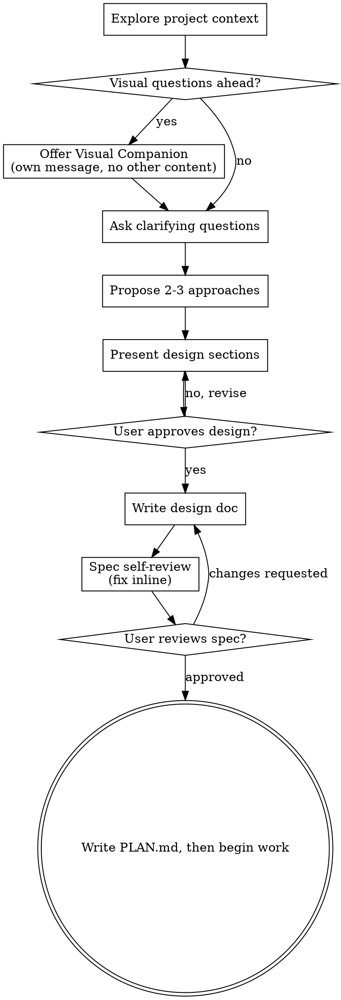

# Brainstorming Ideas Into Designs

*Provided as part of your ShadowDesk engagement. Not for resale or redistribution.*

Help turn ideas into fully formed designs and specs through natural collaborative dialogue.

Start by understanding the current project context, then ask questions one at a time to refine the idea. Once you understand what you're building, present the design and get user approval.

<HARD-GATE>
Do NOT start building, write any code, send anything out, or take any concrete action until you have presented a design and the user has approved it. This applies to EVERY project regardless of perceived simplicity.
</HARD-GATE>

## Anti-Pattern: "This Is Too Simple To Need A Design"

Every project goes through this process. A quick client email, a one-page offer, a small workflow tweak — all of them. "Simple" projects are where unexamined assumptions cause the most wasted work. The design can be short (a few sentences for truly simple projects), but you MUST present it and get approval.

## Checklist

You MUST create a task for each of these items and complete them in order:

1. **Explore context** — check relevant files, the folder's CLAUDE.md (if one exists), recent work
2. **Offer visual companion** (if topic will involve visual questions) — this is its own message, not combined with a clarifying question. See the Visual Companion section below.
3. **Ask clarifying questions** — one at a time, understand purpose/constraints/success criteria
4. **Propose 2-3 approaches** — with trade-offs and your recommendation
5. **Present design** — in sections scaled to their complexity, get user approval after each section
6. **Write design doc** — save to the relevant project folder as `YYYY-MM-DD-<topic>-design.md` and (if the project uses version control) commit it
7. **Spec self-review** — quick inline check for placeholders, contradictions, ambiguity, scope (see below)
8. **User reviews written spec** — ask the user to review the spec file before proceeding
9. **Transition to execution** — capture the approved design as a short PLAN.md in the relevant project folder, then begin the work

## Process Flow

**The terminal state is a written, approved plan.** Once the design is approved, capture it as a short PLAN.md in the relevant project folder, then proceed to do the work. Don't skip ahead to building — a pitch site, a deck, an email send, an automation — before the design is approved.

## The Process

**Understanding the idea:**

- Check out the current project state first (files, docs, recent work)
- Before asking detailed questions, assess scope: if the request describes multiple independent pieces (e.g., "build a client onboarding system with intake, scheduling, deliverables, and billing"), flag this immediately. Don't spend questions refining details of a project that needs to be decomposed first.
- If the project is too large for a single spec, help the user decompose into sub-projects: what are the independent pieces, how do they relate, what order should they be built? Then brainstorm the first sub-project through the normal design flow. Each sub-project gets its own spec → plan → execution cycle.
- For appropriately-scoped projects, ask questions one at a time to refine the idea
- Prefer multiple choice questions when possible, but open-ended is fine too
- Only one question per message - if a topic needs more exploration, break it into multiple questions
- Focus on understanding: purpose, constraints, success criteria

**Exploring approaches:**

- Propose 2-3 different approaches with trade-offs
- Present options conversationally with your recommendation and reasoning
- Lead with your recommended option and explain why

**Presenting the design:**

- Once you believe you understand what you're building, present the design
- Scale each section to its complexity: a few sentences if straightforward, up to 200-300 words if nuanced
- Ask after each section whether it looks right so far
- Cover the pieces involved, how they connect, what happens when something goes wrong, and how you'll know it worked
- Be ready to go back and clarify if something doesn't make sense

**Design for isolation and clarity:**

- Break the work into smaller pieces that each have one clear purpose and can be understood on their own
- For each piece, you should be able to answer: what does it do, how is it used, and what does it depend on?
- Can someone understand what a piece does without digging into its internals? Can you change the internals without breaking the things that depend on it? If not, the boundaries need work.
- Smaller, well-bounded pieces are also easier to work with — you reason better about something you can hold in your head at once, and your work is more reliable when each piece is focused. When one piece is trying to do too many things, that's a signal to split it.

**Working within your existing system:**

- Explore the current setup before proposing changes. Follow the patterns already in place.
- Where something existing gets in the way of the work (a process that's grown unwieldy, unclear ownership, tangled responsibilities), include targeted fixes as part of the design — the way a good operator improves what they're working in.
- Don't propose unrelated overhauls. Stay focused on what serves the current goal.

## After the Design

**Documentation:**

- Write the validated design (spec) to the relevant project folder as `YYYY-MM-DD-<topic>-design.md`
  - (User preferences for spec location override this default)
- Write it clearly and concisely.
- If the project is under version control, commit the design document.

**Spec Self-Review:**
After writing the spec document, look at it with fresh eyes:

1. **Placeholder scan:** Any "TBD", "TODO", incomplete sections, or vague requirements? Fix them.
2. **Internal consistency:** Do any sections contradict each other? Does the design match the goal it's supposed to serve?
3. **Scope check:** Is this focused enough for a single plan, or does it need decomposition?
4. **Ambiguity check:** Could any requirement be interpreted two different ways? If so, pick one and make it explicit.

Fix any issues inline. No need to re-review — just fix and move on.

**User Review Gate:**
After the spec review loop passes, ask the user to review the written spec before proceeding:

> "Spec written and saved to `<path>`. Please review it and let me know if you want to make any changes before we start writing out the plan."

Wait for the user's response. If they request changes, make them and re-run the spec review loop. Only proceed once the user approves.

**Execution:**

- Capture the approved design as a short PLAN.md in the relevant project folder.
- Then begin the work. Don't kick off any other skill or concrete action before the design is approved.

## Key Principles

- **One question at a time** - Don't overwhelm with multiple questions
- **Multiple choice preferred** - Easier to answer than open-ended when possible
- **YAGNI ruthlessly** - Remove unnecessary features from all designs
- **Explore alternatives** - Always propose 2-3 approaches before settling
- **Incremental validation** - Present design, get approval before moving on
- **Be flexible** - Go back and clarify when something doesn't make sense

## Visual Companion

A browser-based companion for showing mockups, diagrams, and visual options during brainstorming. Available as a tool — not a mode. Accepting the companion means it's available for questions that benefit from visual treatment; it does NOT mean every question goes through the browser.

**Offering the companion:** When you anticipate that upcoming questions will involve visual content (mockups, layouts, diagrams), offer it once for consent:
> "Some of what we're working on might be easier to explain if I can show it to you in a web browser. I can put together mockups, diagrams, comparisons, and other visuals as we go. This feature is still new and can be token-intensive. Want to try it? (Requires opening a local URL)"

**This offer MUST be its own message.** Do not combine it with clarifying questions, context summaries, or any other content. The message should contain ONLY the offer above and nothing else. Wait for the user's response before continuing. If they decline, proceed with text-only brainstorming.

**Per-question decision:** Even after the user accepts, decide FOR EACH QUESTION whether to use the browser or the terminal. The test: **would the user understand this better by seeing it than reading it?**

- **Use the browser** for content that IS visual — mockups, wireframes, layout comparisons, architecture diagrams, side-by-side visual designs
- **Use the terminal** for content that is text — requirements questions, conceptual choices, tradeoff lists, A/B/C/D text options, scope decisions

A question about a UI topic is not automatically a visual question. "What does personality mean in this context?" is a conceptual question — use the terminal. "Which wizard layout works better?" is a visual question — use the browser.

If they agree to the companion, read the detailed guide in this skill folder before proceeding:
`visual-companion.md`
